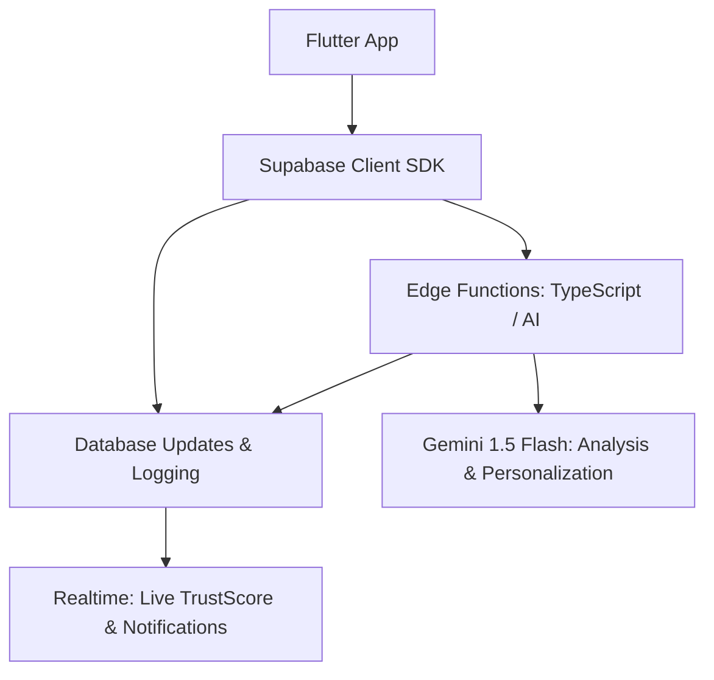

# ElevateAI — Backend Architecture & Core Flywheel

This folder contains the complete backend for ElevateAI, built on Supabase. It implements the **Student DNA Engine** and the **TrustScore Network** — the core "flywheel" that powers personalized student success.

## Architecture Overview

## Core Engine Components

### 1. Student DNA Engine (`recalculate-dna`)
- **Purpose**: Deep analysis of student skills, projects, and achievements.
- **Signal**: Every time a student earns a badge or completes a project, this engine is triggered.
- **Output**: Updates the `student_dna` table with AI-generated narratives, archetypes, and career growth areas.

### 2. TrustScore Network (`update-trust-score`)
- **Formula**: Weighted mix of Reliability (30%), Collaboration (25%), Integrity (20%), Skill Validation (15%), and Community (10%).
- **Flywheel**: 
    - ERP Sync → Reliability boost
    - Peer Rating → Collaboration boost
    - Badge Verified → Skill validation boost
    - Application Accepted → Integrity boost

### 3. ScamShield (`scam-detect`)
- **Purpose**: Automated fraud detection for new opportunities.
- **Mechanism**: Rule-based screening + AI deep-scan. Auto-flags high-risk listings and notifies admins.

### 4. Smart Team Matching (`match-teams`)
- **Purpose**: Personalized team recommendations.
- **Logic**: Calculates composite scores based on skill overlap, archetype balance, and TrustScore compatibility. Provides AI-generated "why we matched" explanations.

### 5. AI Opportunity Engine (`rank-opportunities`)
- **Purpose**: Ranked list of scholarships, internships, and hackathons.
- **Logic**: Hard eligibility filtering (SQL) + AI personalization layer (why this fits your DNA). Includes "stretch opportunities" for growth.

## Database Schema (Summary)

| Category | Key Tables |
|---|---|
| **Identity** | `student_profiles`, `colleges` |
| **Engine** | `student_dna`, `trust_scores`, `trust_score_history` |
| **Verification** | `student_skills`, `student_badges`, `skill_badges` |
| **Growth** | `opportunities`, `opportunity_applications`, `teams`, `team_members` |
| **Behavioral** | `peer_ratings`, `notifications`, `scam_reports` |

## Setup & Deployment

1.  **Configure Environment**: Set `ANTHROPIC_API_KEY` in Supabase Secrets.
2.  **Initialize Database**: Apply migrations in order (`01` through `06`).
3.  **Deploy Functions**: `supabase functions deploy --all`
4.  **Seed Data**: Run `03_seed_data.sql` to populate test students and opportunities.
5.  **Configure Webhooks**: Link `scam-detect` to the `opportunities` table (INSERT event).

## Maintenance & Monitoring

- **Leaderboard**: Refresh `mv_trust_leaderboard` every 15 mins via `pg_cron` or a scheduled Edge Function.
- **Trust History**: Monitor `trust_score_history` to audit flywheel effectiveness.
- **AI Logs**: Review Edge Function logs for model performance and cost tracking.
